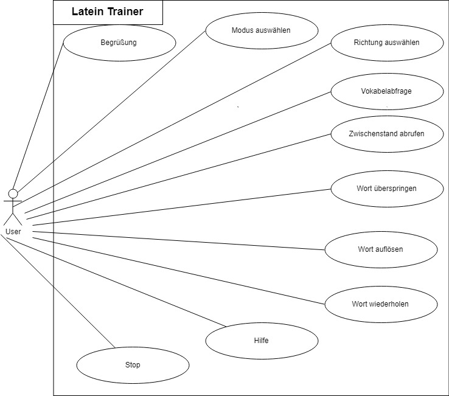
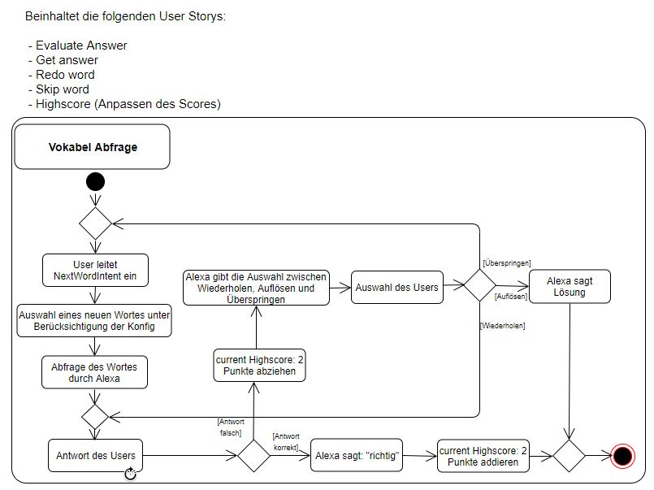
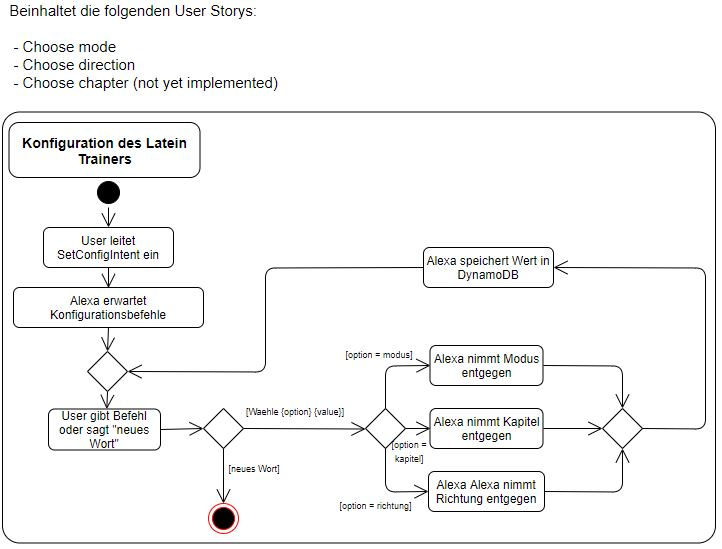
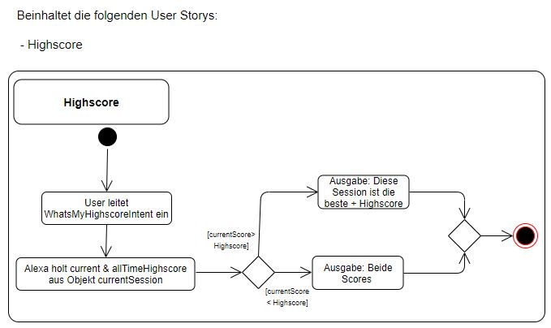
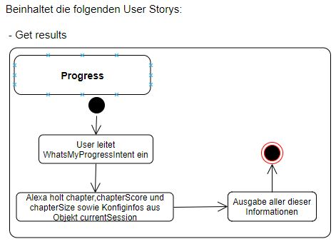
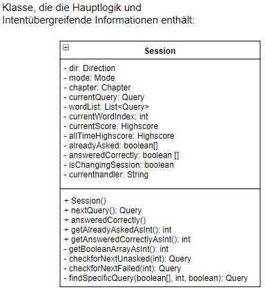
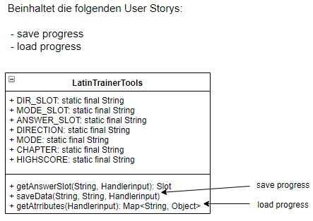

# Lateintrainer

_"Non scholae, sed vitae discimus"_ - Nicht für die Schule, sondern für das Leben lernen wir. - **Seneca**

## Status
[Travis-CI Status](https://travis-ci.org/sweIhm-ws2018-19/skillproject-di-1.svg?branch=master)](https://travis-ci.org/sweIhm-ws2018-19/skillproject-di-1)
[Sonarcloud Status](https://sonarcloud.io/api/project_badges/measure?project=alexa-skills-kit-samples%3Alatintrainer&metric=alert_status)](https://sonarcloud.io/dashboard?id=alexa-skills-kit-samples%3Alatintrainer)

 

## Systemidee
Der Skill soll jedem, der Interesse an der lateinischen Sprache hat, die Möglichkeit bieten, wichtige Wörter effizient zu erlernen. 
Außerdem kann der User sehr viele Konfigurationen vornehmen, um die Abfrageart von Alexa auf seine Vorlieben anzupassen. 
Damit der User weiß, wie erfolgreich eine Session ist/war, kann er seinen jetzigen Fortschritt sowie Highscores nach Belieben abrufen.
## Anwendungsfalldiagramm

## Klassendiagramm des AWS Lambda Funktion

## Aktivitäts- und Klassendiagramme
 
 
 
 
 
 

## Sonstiges
Was ich gelernt habe: viel!
